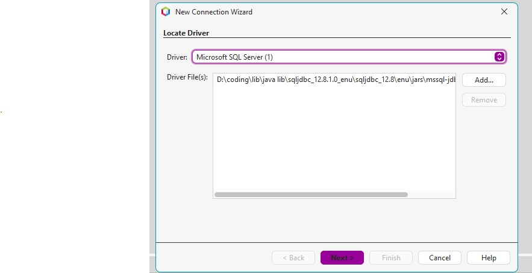

## ¿Cómo crear una conexión en NetBeans 20?

## w
Window > Services   

## w
Services > Databases > New Connection...

3.
    Driver: Microsoft SQL Server (está en la carpeta recursos de la raíz del proyecto)
    

4. 
    Database: hibernate_test
    User Name: sa
    Password: 1234
    JDBC URL: jdbc:sqlserver://localhost:1433;databaseName=hibernate_test;encrypt=false
    