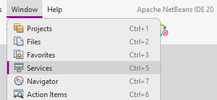
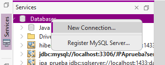
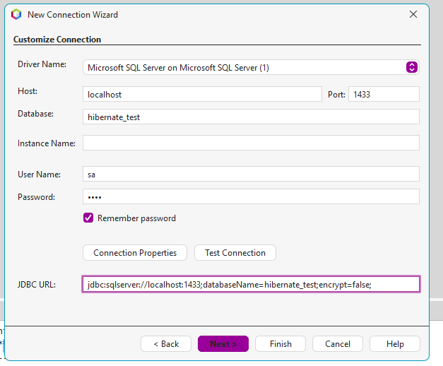

## ¿Cómo crear una conexión en NetBeans 20?

### Window > Services   

### Services > Databases > New Connection...

### Driver: Microsoft SQL Server (está en la carpeta recursos de la raíz del proyecto)

Database: hibernate_test

User Name: sa

Password: 1234

JDBC URL: jdbc:sqlserver://localhost:1433;databaseName=hibernate_test;encrypt=false

